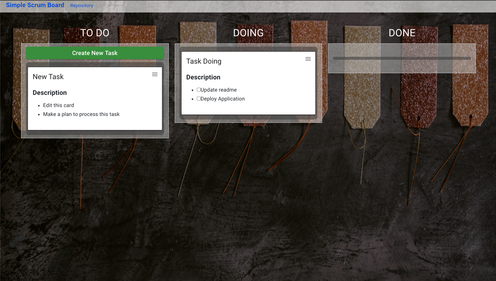

# Simple Scurm Board

## Overview

React.js based simple task board web application.
Tasks and columns can drag-and-drop to move.
Task support markdowns.
It save todo data on local storage automatically.

## Pages
- Task Board

### Frameworks
- Next.js
- UI: Material-UI/core
- reaact-beautiful-dnd

### Environment
- [Vercel](https://vercel.com/)

### Reference
- Most of backgarounds are from [Unsplash](https://unsplash.com): 
  - Blackboard: Photo by [Annie Spratt](https://unsplash.com/@anniespratt?utm_source=unsplash&utm_medium=referral&utm_content=creditCopyText) 